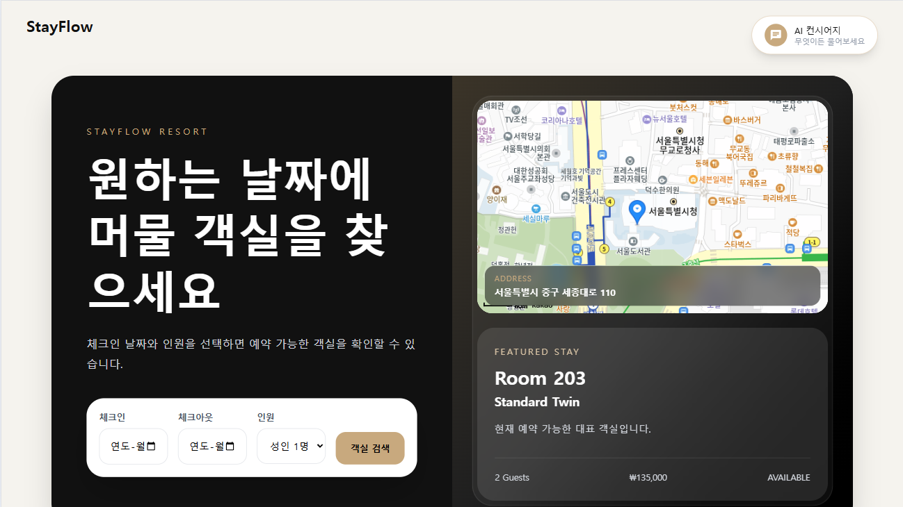
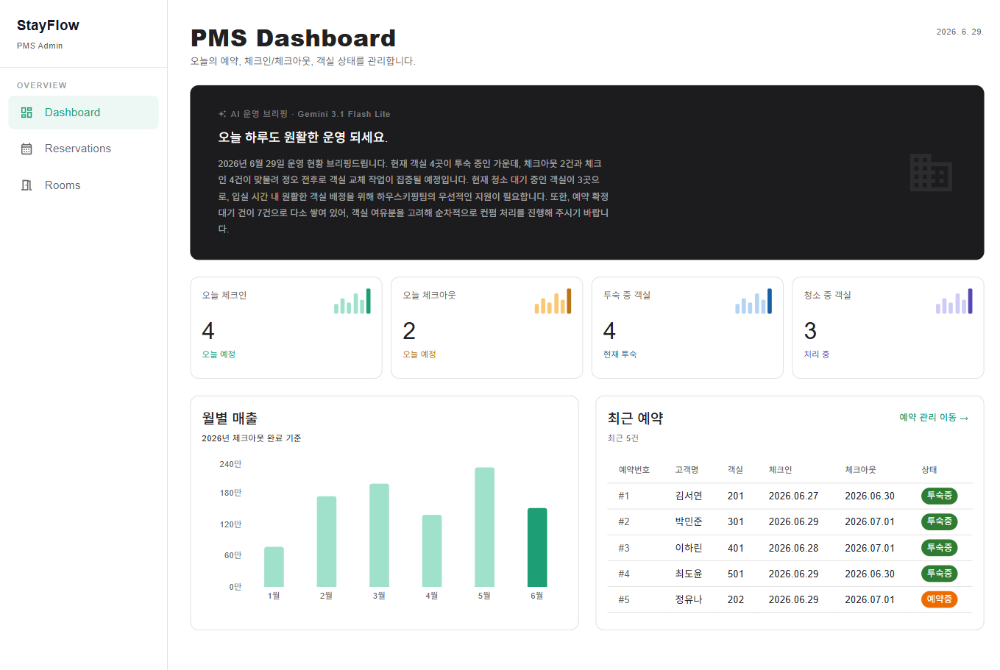
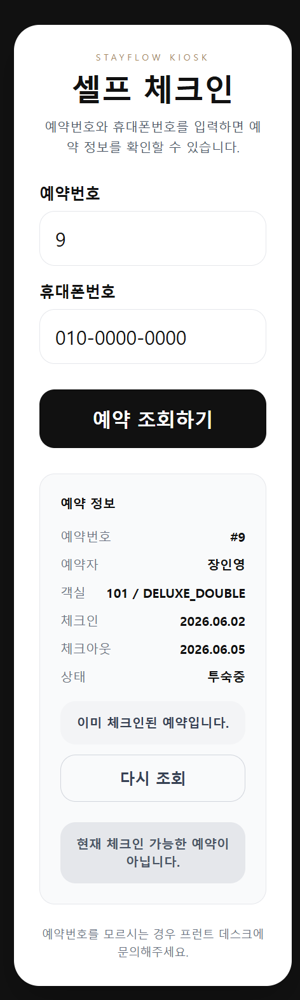

# 🏨 StayFlow

> **호텔 운영 흐름(Customer → PMS → Kiosk)을 통합한 호텔/리조트 운영 플랫폼**

 

  고객 예약 사이트, PMS 관리자 시스템, 키오스크 셀프 체크인을 하나의 흐름으로 연결한 프로젝트입니다.

  
    단순 객실 예약 기능을 넘어, 예약 생성 → 키오스크 체크인 → PMS 객실 상태 관리까지 이어지는 실제 호텔 운영 프로세스를 구현하는 것을 목표로 했습니다.
  

---

## 📸 Screenshots

> 향후 주요 화면 스크린샷을 추가할 예정입니다.

<!--
### Customer Reservation

### PMS Dashboard

### Kiosk Check-in

-->

---

<strong>📌 프로젝트 소개</strong>

 

StayFlow는 호텔 운영 흐름을 통합 관리하기 위한 웹 기반 호텔 운영 플랫폼입니다.

고객 예약 → PMS 운영 → 키오스크 체크인 흐름을 하나의 시스템으로 연결하여 실제 호텔 운영 프로세스를 구현했습니다.

---

<strong>🛠 기술 스택</strong>

 

### Frontend

- React
- Vite
- Tailwind CSS
- Material UI (MUI)
- Axios
- React Router

### Backend

- Spring Boot
- Java 21
- Spring Data JPA
- PostgreSQL
- Hibernate

---

<strong>✨ 주요 기능</strong>

 

### 고객 예약 사이트

- 객실 조회
- 객실 예약
- 예약 조회
- 예약 취소

### PMS 관리자 시스템

- Dashboard 운영 현황
- 예약 관리
- 체크인 / 체크아웃
- 예약 검색 / 상태 필터
- 객실 상태 관리
- 객실 청소 완료 처리
- 객실 상태 변경

### 키오스크

- 예약 조회
- 셀프 체크인
- 체크인 완료 화면

---

<strong>🎬 시연 플로우</strong>

 

### 고객 예약

1. 고객이 객실 조회
2. 예약 생성
3. 예약 조회 확인

### 키오스크 체크인

1. 예약번호 + 휴대폰번호 입력
2. 예약 조회
3. 셀프 체크인 진행
4. 체크인 완료 화면 표시

### PMS 운영

1. 예약 상태 확인
2. 체크인 / 체크아웃 처리
3. 객실 상태 변경
4. 청소 완료 처리

---

## 🎯 프로젝트 목표

호텔 운영 흐름 전체를 이해하고, 고객 예약 사이트 / PMS / 키오스크 시스템을 연결하는 실무형 구조를 경험하는 것을 목표로 했습니다.

